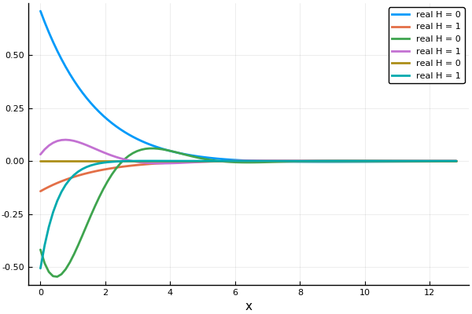

# The many effective wavenumbers
```julia
using EffectiveWaves

medium = Medium(ρ=1.0, c=1.0)

species = [
    Specie(ρ=0.2, r=1.0, c=0.2, volfrac=0.25)
];

ω = 0.6; # For one each angular frequency ω there are a multitude of effective wavenumbers.
num_wavenumbers = 8; # calculate the 8 least attenuating effective wavenumbers

# often more wavenumbers a returned then asked for.
k_effs = wavenumbers(ω, medium, species; num_wavenumbers=num_wavenumbers)

using Plots
scatter(k_effs, lab="Effective wavenumbers")
```


We can calculate the resulting effective field (ensemble average field) from each of these effective wavenumbers by choosing an arbitrary wave amplitude of 1 for each wave.
```julia
# with "extinction_rescalse=false" the amplitude will default to 1.
waves = [EffectiveWave(ω, k_eff, medium, species; extinction_rescale=false) for k_eff in k_effs]

# choose the mesh the size of the lowest attenuating effective wavenumber
x = range(0.; length=100, stop=2pi/abs(k_effs[1]))

plot(x,waves[1], xlabel = "x", hankel_indexes = 0:1)
plot!(x,waves[2], hankel_indexes = 0:1)
plot!(x,waves[3], hankel_indexes = 0:1)
```

